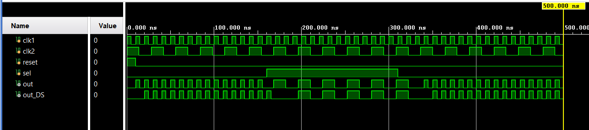

# Glitch-Free Clock Mux using D Flip-Flops

## Overview  
This project implements a **glitch-free clock multiplexer** using **D flip-flops** in Verilog. The design ensures smooth clock switching without glitches when changing between two input clocks.

## Directory Structure  
- **`sim/`**   # Simulation results  
    - `sim.png`  # Output waveform (generated using Vivado)  
- **`src/`**   # Design sources  
    - `dff.v`  # D Flip-Flop module  
    - `glitch_free_clock_mux.v`  # Basic glitch-free clock multiplexer  
    - `glitch_free_clock_mux_ds.v`  # Glitch-free clock mux with double synchronizer  
- **`tb/`**    # Testbench files  
    - `testbench.v`  # Testbench for clock multiplexer  
- **`README.md`**  # Project documentation  

## Design Explanation  
The glitch-free clock multiplexer consists of **D flip-flops** to ensure clean switching between two clocks without introducing glitches. The design has two variations:

- **`glitch_free_clock_mux.v`**: Implements a basic glitch-free clock mux using two D flip-flops.
- **`glitch_free_clock_mux_ds.v`**: Uses **double synchronization** to further reduce potential glitches.

### **Functionality**
- The multiplexer selects between two input clocks (`clk_1` and `clk_2`) based on the `sel` signal.
- A **D flip-flop** is used to delay transitions and prevent glitches.
- The double synchronizer version ensures even smoother transitions by adding an extra set of flip-flops.
- The `reset` signal initializes the circuit.

## Modules  

### **D Flip-Flop (`dff.v`)**  
A **D flip-flop** with an active-high reset. Captures input (`d`) on the rising edge of `clk`.

### **Glitch-Free Clock Mux (`glitch_free_clock_mux.v`)**  
Implements a glitch-free clock multiplexer using **D flip-flops**. Prevents short pulses when switching clocks.

### **Glitch-Free Clock Mux with Double Synchronizer (`glitch_free_clock_mux_ds.v`)**  
Uses **double synchronization** to reduce glitches further by adding additional D flip-flops.

### **Testbench (`testbench.v`)**  
Simulates the clock multiplexer by toggling clocks and switching `sel`. Checks for glitch-free operation.

## Simulation  
Run the testbench in **Vivado ModelSim/ISE** or any Verilog simulator. The expected waveform should show clean clock transitions without glitches.

Example waveform output:  
  

## How to Run  
1. Create a new Project in Vivado.
2. Add all files in `src/` as design sources.
3. Add `tb/testbench.v` file as a simulation source (set as the Top module if needed).
4. Run the simulation and verify the waveform.

## Tools Used  
- **Vivado** for simulation  
- **Verilog HDL** for design  

## License  
This project is open-source. Feel free to use and modify it.  

---
Happy Coding! 🚀

