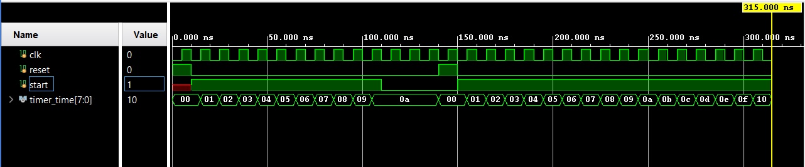

# 8-Bit Timer using T Flip-Flops  

## Overview  
This project implements an **8-bit timer** using **T flip-flops** in Verilog. The timer increments on each clock cycle when the `start` signal is high.  

## Directory Structure  
- **`sim/`**   # Simulation results
    - `sim.png`  # Output waveform (generated using Vivado)
- **`src/`**   # Design sources
    - `tff.v`  # T Flip-Flop module
    - `timer.v`  # Frequency divider using T flip-flops
- **`tb/`**    # Testbench files
    - `timer_tb.v`  # Testbench for frequency divider
- **`README.md`**  # Project documentation

## Design Explanation  
The timer consists of **8 T flip-flops**, which toggle sequentially to form an **8-bit counter**.  

- When `start = 1`, the timer begins counting.  
- When `start = 0`, the timer pauses.  
- When `reset = 1`, the timer resets to **0**.  

## Modules  

### **T Flip-Flop (`tff.v`)**  
A **T flip-flop** with an active-high reset. It toggles state when `T = 1`.  

### **Timer (`timer.v`)**  
An **8-bit counter** built using chained T flip-flops. Each bit toggles on the negated output of the previous bit, forming a sequential counter.  

### **Testbench (`timer_tb.v`)**  
The testbench initializes the clock, start, and reset signals to test the timer's functionality, including starting, pausing, and resetting.  

## Simulation  
Run the testbench in **Vivado ModelSim/ISE** or any Verilog simulator. The expected waveform should show frequency division at each stage.  

Example waveform output:  
  

## How to Run  
1. Create a new Project in Vivado.
2. Add all files in `src/` as desgin sources.
3. Add `tb/freq_divider_tb.v` file to simualtion source (Select it as Top module if not already).
3. View the generated waveform by running the simulation to verify correctness.

## Tools Used  
- **Vivado** for simulation  
- **Verilog HDL** for design  

## License  
This project is open-source. Feel free to use and modify it.  

---
Happy Coding! 🚀  
